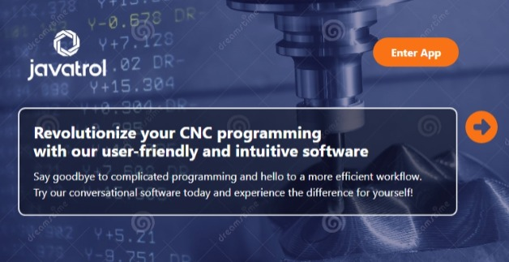
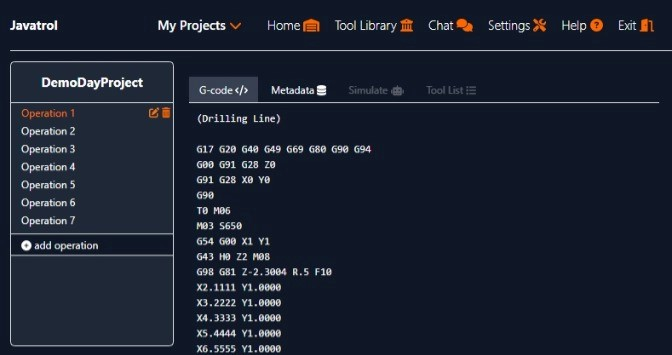

<!---
### Contribution Activity

This section will not be displayed on the GitHub overview page.
--->

<!DOCTYPE html>
<html>
<head>
  <meta charset="UTF-8">
</head>
<body>
  <header>
  <a href="https://git.io/typing-svg">
   
  </a>
  

   
  

   Welcome to my GitHub! I am a software developer with a passion for engineering and problem solving. I love building innovative solutions, and creating cool projects with real applications. I have a background in manufacturing technology and I am very excited to apply my newly honed skills to old and upcoming challenges alike.
   

  <li> 🎓 I graduated! Web development certificate @ <a href="https://bootcamp.learn.utoronto.ca/coding/"> The University of Toronto</a> </li>
   <li> 🔭 I’m currently working on a <a href="https://javatrol.herokuapp.com">cnc-gcode-generator</a> and a <a href="https://github.com/gregArijah/workforce-manager">workforce-manager</a>. </li>
  <li>🌱 I’m currently learning C# and the .NET Framework. </li>
  <li>🤔 I’m looking for good first issues in open source projects. </li>
  <li>💬 Ask me about manfacturing; CNC programming and machining. </li>
  <li>📫 How to reach me: <a href="mailto:gregarijah@gmail.com">gregarijah@gmail.com</a> </li>
  

  
  

 

 
  
  <h2>Technologies</h2>
  

    
    
        
    
    
      
    
    
    
    
    
    
  

   
  <h2>Projects</h2>
  

    
Javatrol is a web based coversational CNC programming tool designed by machinists for machinists. From its inception it was meant to be user friendly, intuitive and provide all the coulds that "if only this program could..." (click image to follow link)
       
      
        
      
    

    
 Nanji is a web based workforce management application. The initial release of the app will focus mainly on calculating the number of hours a given employee has worked over a selected period of time. (click image to follow link)
       
      
    

  

  
</body>
</html>
